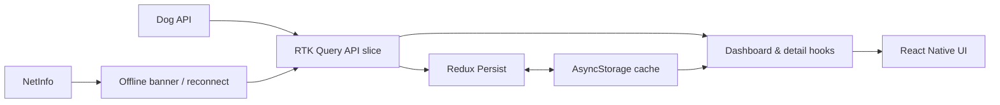
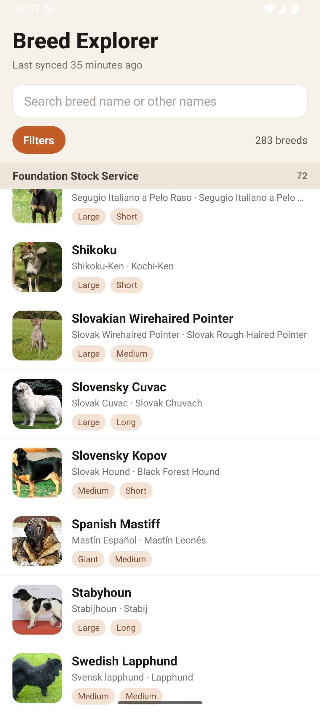
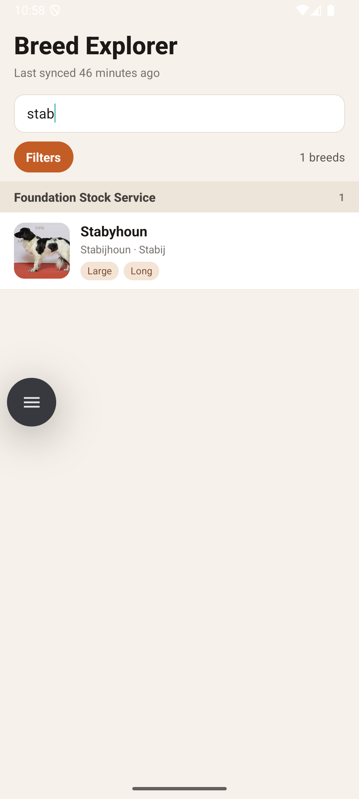
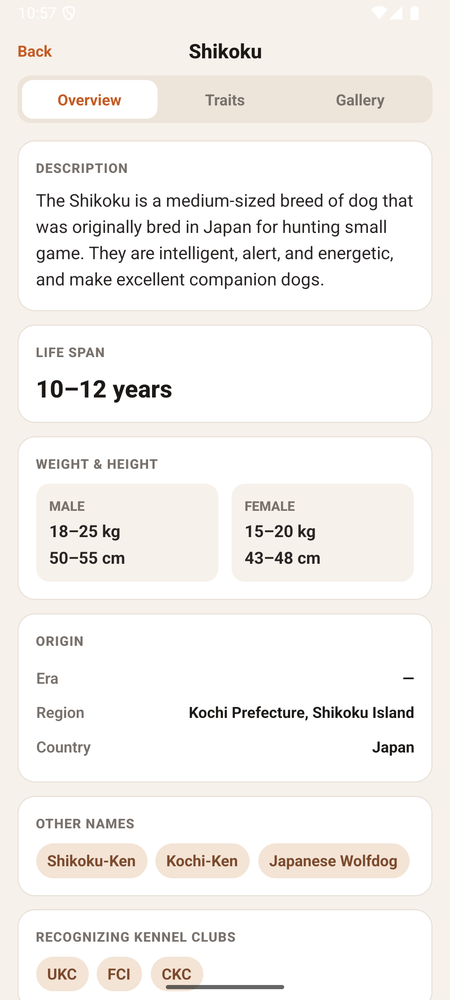
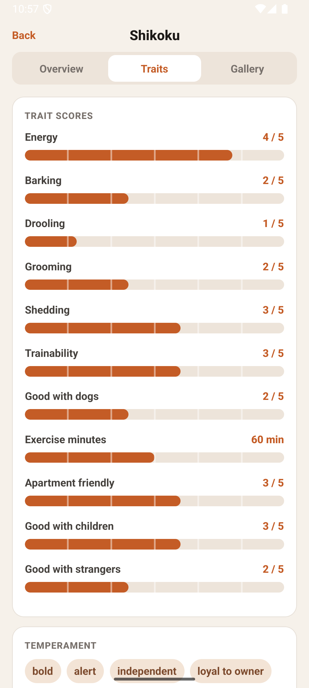
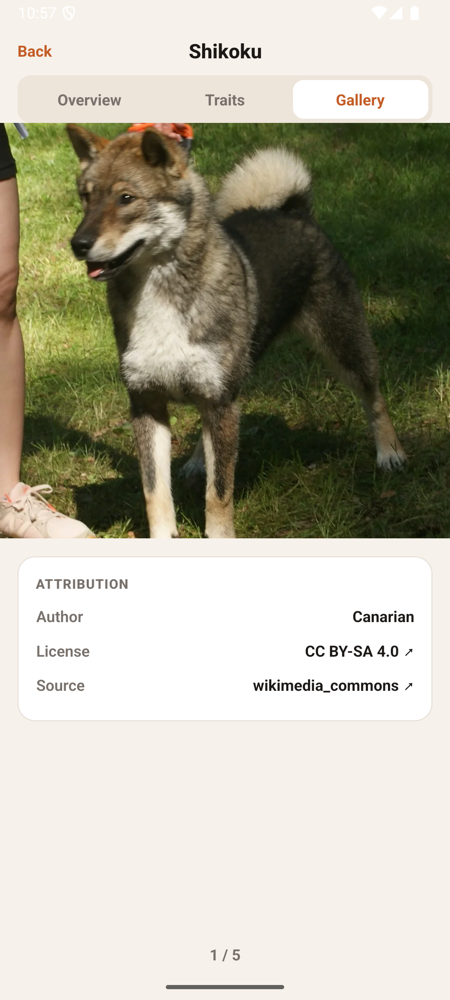

# Tripare — Breed Explorer

A React Native app for browsing, searching, and filtering 283 dog breeds. It presents breed profiles with an overview, trait scores, and image gallery, while retaining cached data for useful offline behavior.

The app gets its data from the public Dog API through RTK Query. The dashboard fetches the paginated breed catalogue in small concurrent windows, derives search/filter/grouped-list views locally, and opens individual profiles from the same cached catalogue before requesting their full detail. Redux Persist writes the RTK Query cache to AsyncStorage, so the last successful catalogue is available immediately after a restart.

Connectivity is treated as a first-class UI state: NetInfo drives the offline banner, cached results remain readable when the network is unavailable, and RTK Query refreshes active data when the app regains focus or a connection. The result is a responsive catalogue for normal browsing without assuming a network is always present.

## Quick Start

Prerequisites: Node.js 22.11+ and a configured React Native iOS or Android environment.

```sh
npm install
cp .env.example .env
npm run ios  # or npm run android
```

On a machine with the native toolchain already set up, this should be running in under three minutes. The first iOS build may additionally require CocoaPods installation in `ios/`.

## Architecture Overview

Tripare keeps server state separate from UI state. RTK Query owns requests, normalization-by-cache-key, loading/error state, cache lifetime, and reconnect/focus refresh behavior. The screens use its generated hooks, while lightweight screen-local React state handles search input, the 300 ms debounce, selected filters, and filter-panel visibility.

The persisted cache is the boundary between online and offline use. Breed and group responses flow from the API into RTK Query, then are stored through Redux Persist in AsyncStorage. Screens render that cached data immediately; a successful reconnect safely replaces it with fresh responses. `SectionList` receives memoized, grouped results, keeping the full breed catalogue practical to render.



**Data flow:** API → RTK Query cache → persisted AsyncStorage → React Native UI.

## Key Technical Decisions

| Decision | Choice | Why |
| --- | --- | --- |
| State management | Redux Toolkit + RTK Query | Server state is co-located with fetching, cache status, invalidation-ready endpoints, and generated hooks. It avoids custom request bookkeeping while leaving transient input/filter state local to each screen. |
| Local database | AsyncStorage via Redux Persist | The catalogue is modest in size and key/value persistence is sufficient. It is reliable across restarts, has no schema/migration overhead, and works naturally with the Redux cache. A relational database would add complexity without a demonstrated query need. |
| Offline sync | Persist cache; detect connectivity with NetInfo; refetch on reconnect/focus | Cached breeds stay visible offline. A visible offline/partial-data state makes freshness explicit, while reconnect and focus refreshes reconcile the cache with the API. The all-breeds request fetches pages in two-page windows and preserves successful pages when a later page fails. |

## Performance Report

Measurements below are from the supplied Android Studio / React DevTools captures using the full 283-breed catalogue. They are useful baseline evidence, not release-device benchmarks.

| Area | Result | Evidence / interpretation |
| --- | --- | --- |
| Full-list React commit | 36 ms render; 0.9 ms layout effects; 2.7 ms passive effects | React DevTools Profiler capture of the 283-breed list. The selected commit is over one 60 Hz frame, so it is a baseline to monitor rather than a claim that every full-list update is frame-perfect. |
| Native allocations | 24,716,296 B allocated; 13,008,092 B remaining | Android Studio Native Allocations capture. |
| JavaScript heap | 41.4 MB snapshot | React DevTools Memory capture. Breed objects account for about 2.36 MB retained; image metadata about 1.61 MB. |
| Interaction FPS | Not directly sampled in the supplied trace | A performance trace is included below, but it does not show an FPS counter. Validate a release build with Android Studio/JankStats or Xcode Instruments before setting an FPS target. |
| Bundle size | Not captured | No release APK/IPA or Metro bundle artifact was supplied, so a trustworthy JS/native breakdown cannot be reported without fabricating a value. Generate a release artifact and record APK/IPA, JS, assets, and native-library sizes here. |

### Profiler evidence — full catalogue render


### Memory evidence


### Interaction trace


> The three diagnostic screenshots above are referenced as supplied performance evidence. Add the original files at the named paths when publishing this repository if they are not present in your clone.

## Screenshots

| Breed catalogue | Filtered search |
| --- | --- |
|  |  |
| Breed details — overview | Breed details — traits |
|  |  |
| Breed details — gallery | Offline state |
|  | The dashboard exposes an offline banner while continuing to render the persisted breed cache. |

## Development

```sh
npm test
npm run lint
```

The app currently targets the public `https://dogapi.dog/api/v2` endpoint and needs no secrets; `.env` is reserved for future configuration.
